<!--
  👀 Reading the source? Respect.
  All the art lives in ./assets and is generated by scripts/build_assets.py.
  psst... the side quests near the bottom are clickable.
-->

  
  

 

  

  
  
  
  
  

 

<!-- ─────────────────────────────── 01 · WHOAMI ─────────────────────────────── -->


  

 

<!-- ─────────────────────────── 02 · CHARACTER SELECT ────────────────────────── -->


  

 

<!-- ───────────────────────────── 03 · INVENTORY ────────────────────────────── -->


<table>
  <tr>
    <td align="center" width="200"><b>⚔️ MAIN WEAPONS</b> languages</td>
    <td></td>
  </tr>
  <tr>
    <td align="center"><b>🛡️ ARMOR</b> frameworks & runtimes</td>
    <td></td>
  </tr>
  <tr>
    <td align="center"><b>🔮 SPELLBOOK</b> AI / ML</td>
    <td></td>
  </tr>
  <tr>
    <td align="center"><b>🎒 UTILITY BELT</b> devops, tools & data</td>
    <td></td>
  </tr>
</table>

 

<!-- ───────────────────────────── 04 · QUEST LOG ────────────────────────────── -->


  <a href="https://github.com/prem-2006/CS2-HandGesture-control"></a>
  <a href="https://github.com/prem-2006/stock_automation"></a>

  <a href="https://github.com/prem-2006/Ai-roads"></a>
  <a href="https://github.com/prem-2006/task-flow"></a>

  <a href="https://github.com/prem-2006/Terminal-Notes-Vault-with-Tagging"></a>
  <a href="https://github.com/prem-2006/luckycard"></a>

  

 

<!-- ──────────────────────────── 05 · OPEN SOURCE ───────────────────────────── -->


| Result | Boss | Winning move |
| :---: | :--- | :--- |
|  | [**ESP-Website** #5685](https://github.com/learning-unlimited/ESP-Website/pull/5685) | Fixed an HTTP 500 in `AdminReviewApps` for students without applications |
|  | [**ESP-Website** #4532](https://github.com/learning-unlimited/ESP-Website/pull/4532) | Stopped the admin toolbar from overlapping page content |
|  | [**ESP-Website** #4768](https://github.com/learning-unlimited/ESP-Website/pull/4768) | `fix(lottery)`: cast the priority index to `int` in `get_computed_schedule` |
|  | [**mofa-studio** #65](https://github.com/mofa-org/mofa-studio/pull/65) | Removing the shared solve-group from environments |

<a href="https://github.com/search?q=author%3Aprem-2006+type%3Apr&type=pullrequests">see every pull request →</a>

 

<!-- ─────────────────────────────── 06 · STATS ──────────────────────────────── -->


  
  

  

 

<!-- ──────────────────────────── 07 · SIDE QUESTS ───────────────────────────── -->


<b>🕹️ SIDE QUEST #1 — "It's 3 AM and prod is down"</b> &nbsp;(click to play)

 

> 📟 **3:07 AM.** Your phone won't stop buzzing. Production is on fire. What do you do?

☕ <b>A)</b> Make chai first. Priorities.

 

> Wise. **+10 focus.** The logs scream: `TypeError: undefined is not a function`. Classic.

🔍 <b>A1)</b> Actually read the stack trace

 

> Found it in 4 minutes — a missing `await`. Hotfix shipped, tests green, back in bed by 3:30.
>
> 🏆 **ACHIEVEMENT UNLOCKED: Senior Energy**

🙈 <b>A2)</b> Blame the intern

 

> You run `git blame`. It was you. Six months ago.
>
> 💀 **GAME OVER** — <i>close this and try again</i>

🚀 <b>B)</b> Push a hotfix straight to <code>main</code>

 

> No tests. No review. Pure vibes. CI turns red and prod is now *more* down.
>
> 💀 **GAME OVER**

😴 <b>C)</b> Go back to sleep

 

> You wake up at 9. The bug fixed itself. Nobody knows how. Nobody will *ever* know.
>
> 🌀 **SECRET ENDING UNLOCKED**

<b>🔐 classified.txt</b> &nbsp;— do <i>not</i> click this

 

  

 

<!-- ───────────────────────────── 08 · CO-OP MODE ───────────────────────────── -->


  <b>Got an idea, a bug worth hunting, or a side quest? Party up — let's turn it into something real.</b>

  

  
  

 

  

  ⭐ Building the future, one commit at a time — <b>Jalwa Hai Hamara</b> ⭐

